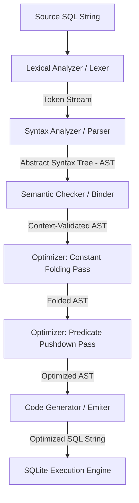

# SQL Query Optimizer: Compiler Construction Technical Deep Dive

This document provides a comprehensive explanation of the **SQL Query Optimizer** project, detailing its architecture and implementation from a **Compiler Construction** perspective. 

The application is structured as a full-stack compiler wrapper: it takes a raw SQL query string, tokenizes and parses it into an Abstract Syntax Tree (AST), runs semantic validation against a database schema, performs AST-level optimization passes, and generates optimized SQL ready for execution.

---

## 1. Compiler Architecture Overview

The system implements a classic **front-end / back-end compiler pipeline** adapted for database query translation and optimization:



---

## 2. Lexical Analysis (The Lexer)

The **Lexer** (implemented in `lexer.py`) is responsible for scanning the source SQL query character-by-character and grouping characters into valid grammatical units called **lexemes**, which are emitted as typed **Tokens**.

### Token Definition
The compiler defines a subset of standard SQL tokens (`TOKEN_TYPES`):
- **Keywords**: `SELECT`, `FROM`, `WHERE`, `JOIN`, `ON`, `AND`, `OR`
- **Identifiers (IDs)**: Column names, table names, and aliases (e.g. `employees`, `e`, `salary`)
- **Literals**: `NUMBER` (integers) and `STRING` (characters inside single quotes `'`)
- **Operators**: Comparisons (`EQ` `=`, `LT` `<`, `GT` `>`)
- **Separators**: `COMMA` `,`, `DOT` `.`, `STAR` `*`, `SEMICOLON` `;`
- **Grouping**: `LPAREN` `(`, `RPAREN` `)`
- **Sentinel**: `EOF` (End of File)

### Implementation Strategy
The lexer is hand-written using a single, verbose regular expression with named capturing groups (`re.VERBOSE`). This approach groups character matches efficiently without needing a heavy parser-generator like Lex/Flex:

```python
pattern = re.compile(r"""
    \s*(?P<NUMBER>\d+)
    |\s*(?P<STRING>'[^']*')
    |\s*(?P<ID>[a-zA-Z_][a-zA-Z0-9_]*)
    |\s*(?P<COMMA>,)
    |\s*(?P<DOT>\.)
    |\s*(?P<STAR>\*)
    |\s*(?P<SEMICOLON>;)
    |\s*(?P<EQ>=)
    |\s*(?P<LT><)
    |\s*(?P<GT>>)
    |\s*(?P<LPAREN>\()
    |\s*(?P<RPAREN>\))
    |\s+
""", re.VERBOSE)
```

**Key Lexing Behaviors:**
1. **Case-Insensitivity**: Identifiers are matched, and their upper-case representations are checked against the `KEYWORDS` set. If found, the token type is upgraded from `ID` to the specific keyword type (e.g. `SELECT`).
2. **String Quote Stripping**: Single-quoted string literals have their surrounding quote characters stripped before the token value is saved.
3. **Whitespace Pruning**: Empty whitespace acts as a separator but does not emit a token.

---

## 3. Syntactic Analysis (The Parser)

The **Parser** (implemented in `parser.py`) converts the flat token stream into a hierarchical structure called the **Abstract Syntax Tree (AST)**.

### Grammar & Parser Style
The compiler uses an **LL(1)** style grammar, implemented via a hand-written **Recursive Descent Parser**. The parser reads tokens from left to right, using a lookahead of one token to decide which production rule to expand.

```
Query          ::= "SELECT" ColumnList "FROM" TableList [ "WHERE" Condition ]
ColumnList     ::= Column { "," Column }
Column         ::= "*" | ID [ "." ( ID | "*" ) ]
TableList      ::= Table { JoinClause | "," Table }
Table          ::= ID [ ID ]  -- (Table Name and optional Alias)
JoinClause     ::= "JOIN" Table "ON" Condition
```

### Precedence Handling in Logical Expressions
A major challenge in parsing boolean expressions in SQL is managing operator precedence (e.g., `AND` has higher precedence than `OR`, and comparisons have higher precedence than both). The recursive descent parser handles this by establishing a call hierarchy:

```python
def parse_condition(self) -> Condition:
    return self.parse_or_condition()

def parse_or_condition(self) -> Condition:
    left = self.parse_and_condition()
    while self.current.type == 'OR':
        self.eat('OR')
        right = self.parse_and_condition()
        left = Condition(type='OR', left=left, right=right)
    return left

def parse_and_condition(self) -> Condition:
    left = self.parse_comparison()
    while self.current.type == 'AND':
        self.eat('AND')
        right = self.parse_comparison()
        left = Condition(type='AND', left=left, right=right)
    return left
```

If the parser encounters a left parenthesis `LPAREN` `(`, it recursively restarts the expression parsing from `parse_condition()`, resetting the precedence tree for the parenthesized sub-expression.

---

## 4. Abstract Syntax Tree (AST) Nodes

The AST consists of linked class structures (defined in `ast_nodes.py`) representing structural SQL semantics:

```
                  [Query Node]
                 /     |      \
     [ColumnList]  [TableList]  [Condition Node (AND)]
      /        \       |         /                 \
[Col: name] [Col: id] [...]   [Comp Node (>)]   [Comp Node (=)]
                               /         \       /         \
                       [Col: salary] [50000] [1]          [1]
```

- **`Query`**: Holds fields for columns to select, the table/join structures, and the optional `where` condition.
- **`TableList`**: Groups base tables and a list of `Join` nodes.
- **`Join`**: Contains target joined `Table` and the joining `on` condition tree.
- **`Condition`**: Represents logical gates (`AND`, `OR`), comparisons (`COMP`), or boolean literals (`TRUE`, `FALSE`).
- **`Comparison`**: Holds left operand, comparison operator (`=`, `<`, `>`), and right operand.
- **`Column`** / **`Constant`**: The leaf nodes of the tree.

---

## 5. Semantic Checking & Schema Resolution

A syntactically valid query may still be semantically incorrect (e.g. referencing a non-existent table, or comparing incompatible types). The **Semantic Checker** (implemented in `checker.py`) performs contextual verification against `schema.json`:

1. **Table Resolution**: Inspects base tables and joined tables to verify they exist in the schema.
2. **Column Binding & Alias Resolution**:
   - Resolves aliases (e.g. `e.name` where `e` is an alias of `employees`) and registers them in a local symbol table.
   - Binds unqualified columns (e.g., `salary`) to their tables. If a column name is unique in the database schema, it is bound automatically. If it appears in multiple active tables, the checker throws an `Ambiguous column reference` semantic error.
3. **Type Consistency**: Compares left and right operands in comparisons to prevent semantic type errors (e.g. comparing a text field to a numerical value).

---

## 6. Optimization Passes (The Optimizer Core)

Once the AST is validated, the compiler performs AST mutation passes to generate an equivalent but computationally cheaper tree representation.

### Pass 1: Constant Folding
Constant folding evaluates expressions containing only constant values during compilation rather than database runtime. It recursively simplifies logical trees:

- **Base Comparisons**: If left and right operands are constants (e.g. `1 = 1`), the compiler evaluates them immediately and replaces the comparison node with a boolean constant node (`Condition(type='TRUE')` or `Condition(type='FALSE')`).
- **Identity Reductions**:
  - `FALSE AND X` ➔ `FALSE` (The compiler short-circuits the branch and prunes `X` entirely)
  - `TRUE AND X` ➔ `X`
  - `TRUE OR X` ➔ `TRUE`
  - `FALSE OR X` ➔ `X`

**AST Mutation Outcomes:**
- If the root `WHERE` condition reduces to `TRUE`, the compiler removes the `where` field from the `Query` node.
- If it reduces to `FALSE`, the compiler replaces the WHERE clause with a simple contradiction (`1=0`). When SQLite receives this, it skips scanning the rows entirely.

---

### Pass 2: Predicate Pushdown
**Predicate pushdown** is an optimization pass that moves filtering operations (predicates, such as `d.dept_name = 'Engineering'`) down the logical execution tree so that they are evaluated as early as possible—specifically **before** joining relations rather than after.

#### Why Filtering Before Joining is Beneficial (Performance Rationale)

Performing joins is one of the most computationally expensive operations in relational databases. Filtering rows *before* joining provides massive performance gains due to several key factors:

1. **Reduction in Input Cardinality ($O(M \times N)$ Complexity)**:
   - A classic join algorithm (like a **Nested Loop Join**) has a time complexity of $O(M \times N)$, where $M$ and $N$ are the number of rows in the outer and inner tables.
   - If Table $A$ has $10,000$ rows and Table $B$ has $10,000$ rows, an unoptimized join processes up to $100,000,000$ row comparisons before applying a `WHERE` filter.
   - If we filter Table $B$ down to $100$ rows *before* joining, the comparison count drops to $10,000 \times 100 = 1,000,000$ — a **99% reduction in computational work**.

2. **Reduced Memory and Temp Disk Footprint**:
   - Modern engines use **Hash Joins** or **Sort-Merge Joins** which build hash tables or sort relations in memory.
   - Pushing the predicate down ensures that only the qualified subset of rows is sorted or loaded into a hash table, preventing the database from swapping data to disk (disk-spill) when memory limits are exceeded.

3. **Disk I/O Reduction**:
   - In physical storage systems, if a predicate is pushed down all the way to the table scan level, the engine can utilize **indices** to read only the target blocks of data from the disk. This avoids a full table scan and minimizes disk read operations.

4. **Network Bandwidth Savings (Distributed Databases)**:
   - In distributed databases, joining tables requires shuffling rows across network nodes. Filtering tables locally before broadcasting them over the network reduces network congestion and query latency.


```
       [Original Execution]                      [Pushed Down Execution]
       
         Filter (dept_name)                          Join (e.id = p.lead_id)
                |                                    /                     \
       Join (e.id = p.lead_id)                  Employee Table          Filter (budget)
       /                     \                                                 |
Employee Table          Project Table                                    Project Table
```

**Implementation Steps:**
1. **Conjunct Extraction**: The compiler splits the `WHERE` condition tree into a list of independent conjunct sub-trees (expressions separated by `AND`).
2. **Dependency Analysis**: For each conjunct, the optimizer traverses the sub-tree to collect all table references.
3. **Targeted Pushing**:
   - If a conjunct references columns belonging to exactly **one** joined table (e.g. `d.dept_name = 'Engineering'`), the optimizer removes it from the global `WHERE` clause.
   - It is pushed down and merged (using `AND`) into the `ON` condition of the corresponding `Join` node in the AST.
4. **Tree Reconstruction**: The unpushed conjuncts are re-assembled with `AND` operators to form the new, simplified global `WHERE` clause.

**Mathematical Basis:**
In Relational Algebra:
$$\sigma_{d.dept\_name = 'Eng'}(Employees \bowtie_{e.dept\_id = d.id} Departments) \equiv Employees \bowtie_{e.dept\_id = d.id} (\sigma_{dept\_name = 'Eng'}(Departments))$$

---

## 7. Code Generation (CodeGen)

The **Code Generator** (`codegen.py`) translates the optimized AST back into a standard SQL query string.

It performs a **pre-order tree traversal** (also known as a structured visitor pattern):
- Visiting a `Query` node emits `SELECT`, visits the list of `Column` nodes, emits `FROM`, visits the `TableList` nodes, and conditionally emits `WHERE` followed by visiting the remaining `Condition` node.
- Visiting a `Join` node emits `JOIN [table_name] ON` and visits its `on` condition.
- Visiting a `Column` node formats qualified references back into `[table_alias].[column_name]`.

---

## 8. Summary of Optimization Impact

By combining **Constant Folding** and **Predicate Pushdown**, the compiler changes the database query plan:

| Query Example | Original AST Plan | Optimized CodeGen Output | Performance Gains |
| :--- | :--- | :--- | :--- |
| **Constant Folding** | Parses and checks `1=1` for every row in the dataset. | Removes the `WHERE` clause entirely. | Reduces CPU evaluation overhead. |
| **Predicate Pushdown** | Performs a full cross-product join of two large tables, then filters the massive output. | Filters the joined table *first*, reducing the number of row comparisons during the join. | Substantial reduction in memory footprint and IO operations. |
